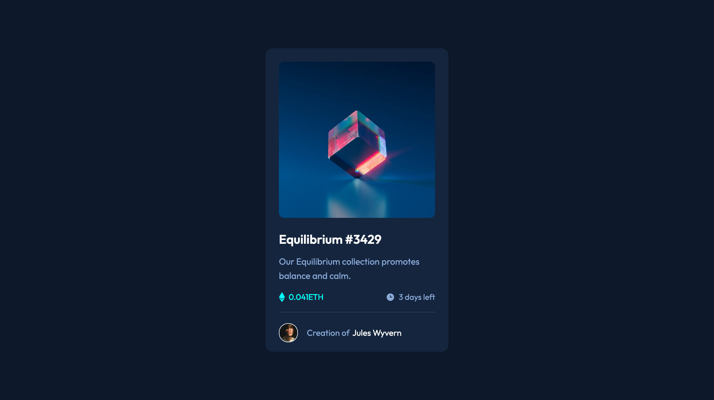

# Frontend Mentor - NFT preview card component solution

This is a solution to the [NFT preview card component challenge on Frontend Mentor](https://www.frontendmentor.io/challenges/nft-preview-card-component-SbdUL_w0U). Frontend Mentor challenges help you improve your coding skills by building realistic projects. 

&nbsp;  
## Table of contents

- [Overview](#overview)
  - [The challenge](#the-challenge)
  - [Screenshot](#screenshot)
  - [Links](#links)
- [My process](#my-process)
  - [Built with](#built-with)
  - [What I learned](#what-i-learned)
  - [Continued development](#continued-development)
  - [Useful resources](#useful-resources)
- [Author](#author)

&nbsp;  
## Overview

### The challenge

Users should be able to:

- View the optimal layout depending on their device's screen size
- See hover states for interactive elements

&nbsp;  
### Screenshot

&nbsp;  
### Links

- Solution URL: (https://github.com/JakeHand/nft-preview-card-component)
- Live Site URL: (https://jakehand.github.io/nft-preview-card-component/)

&nbsp;  
## My process

### Built with

- Semantic HTML5 markup
- CSS custom properties
- Flexbox
- CSS Grid
- Mobile-first workflow

&nbsp;  
### What I learned

This project served as more practice to my HTML and CSS skills. Most of it was pretty easy. I just got stuck on the active state for the nft art. We were required to put a transparent blue filter over the top of the image and a view icon when the art was hovered over.

I switched the image to be a background image so that I could use the background-blend-mode property. However, after going through all of the values, I found that none of them quite matched the look in the design brief. So, after a while I decided to change the color from the given hsl color to an rgba color utilising the alpha (or opacity) channel. This looked much better.

The additional icon on hover was not something I had encountered before either. I tried setting a container for the icon which was the same size as the nft art, setting the icon to display none, and changing the display to block when hovered over. However, this did not work. I thought the issue may be with the display none value so I tried using the z-index property so that before it would be -1 (under the nft art) and then +1 on hover. However, this did not work. I presumse because the nft art container was in the way. That's when I found out about how you can declare the required CSS properties for parent-child elements, and have it so that when the parent gets hovered over, the property of the child will change.

&nbsp;  
### Continued development

I am finding Frontend Mentor great for getting my CSS back up to scratch after a lot of focus on Javascript. Currently these smaller component projects are great because there has been one tricky part in each project which allows you to learn something new on every project, yet not be overwhelmed by multiple problems.

I am going to continue with these Frontend Mentor projects and gradually increase the complexity. I am getting quite confident with my HTML, CSS and Javascript. At some point I would like to focus on learning React.

&nbsp;  
### Useful resources

- [GeeksforGeeks parent-child CSS relationships](https://www.geeksforgeeks.org/how-to-affect-other-elements-when-one-element-is-hovered-in-css/) - 
As I mentioned before, this article helped me learn about parent-child relationships in CSS and how you can use one to alter the other.

&nbsp;  
## Author

- GitHub - [@JakeHand](https://github.com/JakeHand)
- Frontend Mentor - [@JakeHand](https://www.frontendmentor.io/profile/@JakeHand)
- Email - [@jakehandp@gmail.com]
